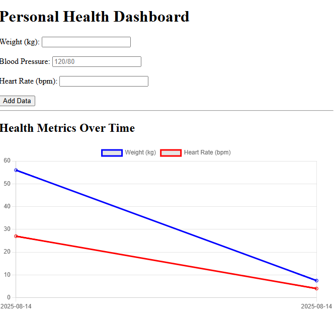
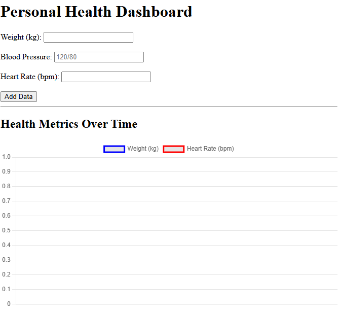

# Personal Health Dashboard

Flask app for tracking personal health metrics with charts (SQLite + Chart.js)

## Quickstart
```bash
pip install -r requirements.txt
python app.py
```
## 📸 Screenshots

**Dashboard Home**  


**Health Chart Example**  

